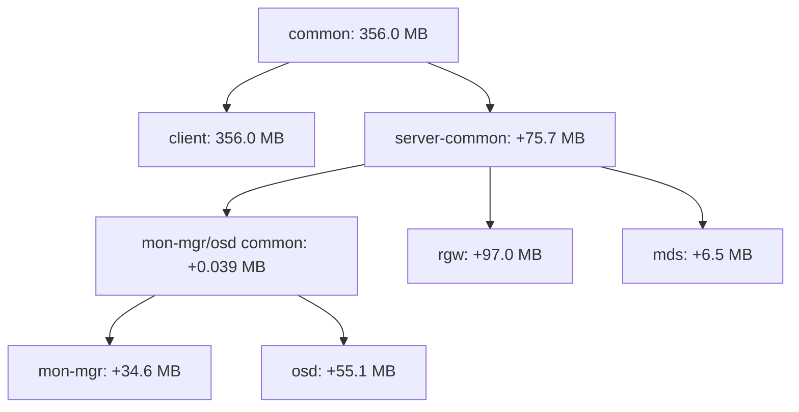

# mon-mgr / osd / rgw / mds / client / all 이미지 구성

분석일: 2026-10-02, Asia/Seoul. 이 6개를 공개 이미지 역할로 나누는 구성은 적절합니다. 내부 build stage는 전체 공통과 서버 공통으로 나누고, `all`은 다른 다섯 역할의 합집합으로 취급합니다.

이번 작업은 역할 경계와 파일 용량을 실제 upstream 이미지에서 분석한 결과입니다. 여섯 role 이미지를 빌드하거나 혼합 이미지 클러스터를 실행한 결과는 아닙니다. 현재 실행 검증된 이미지는 [기존 단일 slim 이미지](SLIM_IMAGE_POC.md)이고, Go API도 하나의 image를 모든 역할에 사용합니다.

## 역할과 실행 방식

| 이미지 | 포함할 기능 | 실행 방식과 필요성 |
| --- | --- | --- |
| `mon-mgr` | MON, MGR, MGR Python/module, `ceph`, `ceph-authtool`, `monmaptool` | 클러스터 부트스트랩·제어. 같은 이미지를 MON/MGR 컨테이너에서 각각 사용 |
| `osd` | OSD, BlueStore와 object class·compressor·crypto·erasure-code plugin | OSD당 컨테이너 1개, 독립 추가·삭제·중단·재시작 |
| `rgw` | RGW와 현재 제어 경로에 필요한 `radosgw-admin` | S3/Swift gateway. S3 I/O는 호스트/앱 SDK에서도 가능 |
| `mds` | MDS와 필요한 native library | CephFS 사용 시에만 실행 |
| `client` | RADOS/RBD CLI, Python·libcephfs 등 userspace client, 진단용 `ceph` CLI | client I/O 검증이 필요할 때 실행. 데몬 없음 |
| `all` | 위 기능 전체 | 현재 단일 image API, 간단한 선택 및 디버깅용 |

`mon-mgr`의 이미지 통합과 컨테이너 통합은 별개입니다. 현재 `Run`은 MON 준비 → MGR 인증키 생성 → 별도 MGR 기동 → MGR availability 확인 순서로 동작합니다. MON과 MGR의 script는 각각 foreground daemon으로 `exec`합니다. 같은 이미지로 두 컨테이너를 유지하면 기존 방식과 MON/MGR 독립 장애 주입을 보존할 수 있습니다.

두 프로세스를 하나의 컨테이너로 합치려면 기동 순서, 양쪽 readiness, TERM/INT 전달, 자식 회수, 한쪽 비정상 종료 처리와 cleanup을 담당하는 PID 1이 필요합니다. 컨테이너 하나의 부가 비용은 줄지만 두 Ceph daemon의 RAM이 없어지지는 않습니다. [Docker 다중 프로세스 설명](https://docs.docker.com/engine/containers/multi-service_container/).

`all`도 모든 바이너리를 포함하는 이미지입니다. 이 태그만으로 모든 daemon을 한 컨테이너에서 실행한다는 뜻은 아닙니다. 기존 PoC처럼 같은 `all` 이미지로 여러 컨테이너를 실행할 수 있습니다.

현재 코드의 경계는 다음과 같습니다.

- MON이 `Container.Ceph`와 OSD 인증키 생성을 수행합니다. 별도의 상시 control 컨테이너를 더 만들 필요는 없습니다.
- MON/MGR readiness도 `ceph status`를 사용하므로 현재 구성에서는 CLI/Python 런타임을 유지해야 합니다.
- OSD/MDS script는 shell·기본 명령과 native daemon을 사용합니다. Python client binding이 그 기동 동작 자체의 필수 요소는 아닙니다.
- `StartRGW`는 RGW 컨테이너 내부의 `radosgw-admin`으로 사용자를 생성합니다. 이 CLI를 client/control로 옮기려면 실행 대상부터 바꿔야 합니다.
- RBD 테스트는 client의 `rbd` CLI, CephFS 테스트는 client의 Python `cephfs` binding을 사용합니다. S3 SDK만 사용하는 RGW 테스트에는 이 client 컨테이너를 생략할 수 있습니다.

## 공통과 고유 파일의 정확한 분할

Ceph 20.2.4 ARM64의 고정된 Quay 이미지에서 설치된 RPM dependency closure를 선별했습니다. 일반 파일의 논리적 크기를 inode로 중복 제거한 결과이며 MB는 1,000,000 bytes입니다. symlink·directory·image tar metadata·role별 manifest는 이 용량에 포함하지 않습니다. Docker image `Size`, registry 전송량, RAM 실측과 구분합니다.

`all`을 제외한 다섯 배포 역할에 대해 각 파일의 membership을 계산했습니다. 아래 그룹은 서로 겹치지 않으며 합계가 `all`의 **624,964,767 bytes**와 일치합니다.

| 파일 그룹 | 공유하는 역할 | 정확한 용량 | 주요 내용 |
| --- | --- | ---: | --- |
| 전체 공통 | `mon-mgr`, `osd`, `rgw`, `mds`, `client` | 356,040,086 bytes | ceph-common, native/client library, Python, ICU, shell·CA 등 |
| 서버 공통 | `mon-mgr`, `osd`, `rgw`, `mds` | 75,673,522 bytes | ceph-base, 원본 RPM DB, SELinux package 등 |
| MON/MGR·OSD 부분 공통 | `mon-mgr`, `osd` | 38,999 bytes | python3-six |
| MON/MGR 고유 | `mon-mgr` | 34,616,755 bytes | MON/MGR executable, MGR core module·Python 추가 의존성 |
| OSD 고유 | `osd` | 55,083,978 bytes | ceph-osd package와 storage 관련 추가 의존성 |
| RGW 고유 | `rgw` | 97,028,970 bytes | ceph-radosgw package와 mailcap |
| MDS 고유 | `mds` | 6,482,457 bytes | ceph-mds |
| client 고유 | `client` | 0 bytes | 현재 RPM 구조에서는 모두 전체 공통에 포함 |

공통이라는 말은 **이번 RPM 선별 모델에서 공통**이라는 뜻입니다. 절대 최소 Ceph runtime을 의미하지 않습니다. ceph-common이 CLI·client binding·검사 도구를 묶고 있기 때문에 네이티브 데몬에서 직접 사용하지 않는 Python이나 도구도 따라옵니다. 서버 공통에도 직접 daemon을 띄우는 이 fixture에서 미사용인 RPM database·policy 파일이 남아 있습니다.

`client` root에 `python3-cephfs`를 명시해 재계산했지만 package와 파일 용량이 추가되지 않았습니다. `ceph-common` closure에 이미 `python3-cephfs`, `python3-rados`, `python3-rbd`가 들어 있습니다. 따라서 1차 패키징에서는 client 이미지가 전체 공통 base와 같은 payload를 사용하는 것이 정상입니다. client 분리의 가치는 테스트 I/O·진단 도구를 독립적으로 실행하고 데몬을 포함한 `all`을 가져오지 않는 데 있습니다.

## 각 이미지의 파일 총량

| 이미지 | 전체 공통 외 추가분 | 파일 총량 | `all` 파일 총량 대비 감소 |
| --- | ---: | ---: | ---: |
| `mon-mgr` | 110.3 MB | 466.4 MB | 25.4% |
| `osd` | 130.8 MB | 486.8 MB | 22.1% |
| `rgw` | 172.7 MB | 528.7 MB | 15.4% |
| `mds` | 82.2 MB | 438.2 MB | 29.9% |
| `client` | 0 MB | 356.0 MB | 43.0% |
| `all` | 268.9 MB | 625.0 MB | — |

추가분에는 서버 공통 약 75.7 MB도 들어 있습니다. 이미지별 총량을 합쳐서 클러스터가 사용하는 고유 파일 용량이라고 표현하면 안 됩니다. MON/MGR를 하나의 image로 묶어도 두 컨테이너가 실행하는 daemon 수와 파일 합집합은 같습니다. 이미지 종류·관리 범위가 줄어드는 효과입니다.

## 권장 layer 구조

공개 tag는 제안한 여섯 개로 유지합니다. `common`, `server-common`, `mon-mgr-osd-common`은 내부 stage로 두면 됩니다.



현재 membership 그룹은 모두 nested 또는 disjoint이므로 위 계층으로 표현할 수 있습니다. 38,999 bytes 그룹을 서버 공통으로 올려 구조를 단순화하는 선택도 가능합니다. 이 경우 RGW/MDS에도 그 파일이 들어가고 이미지별 합집합과 manifest가 조금 바뀌므로 위 exact profile과는 구분해야 합니다.

`all`은 같은 파일 그룹을 다시 합쳐 사용합니다. 현재 가장 큰 branch인 `rgw`를 `FROM`으로 상속하고 다른 그룹을 추가하면 RGW까지의 base prefix를 공유할 수 있습니다. 다른 branch의 전체 rootfs를 다시 `COPY --from`하는 방식은 피하고, 분리된 동일 overlay를 재사용하는 구조를 검토합니다. Docker의 `COPY --link`는 복사 파일을 독립 layer로 만드는 데 사용할 수 있습니다. [Docker multi-stage](https://docs.docker.com/build/building/multi-stage/), [COPY --link](https://docs.docker.com/reference/dockerfile/#copy---link).

빌드 시에는 전체 파일·symlink·hardlink 계획을 먼저 만들고 canonical 경로의 disjoint overlay로 분할해야 합니다. 각 그룹에서 원본 assembler의 재귀 복사를 다시 실행하면 symlink target 때문에 다른 그룹의 공통 파일이 재복사될 수 있습니다. `COPY --link`는 기존 destination symlink를 따라가지 않으므로 `/usr/bin`, `/usr/lib64`, `/run` 등의 실제 경로에 복사합니다. 작은 role manifest는 별도 마지막 layer로 둘 수 있습니다.

layer blob의 공유와 로컬 unpacked snapshot의 공유도 구분합니다. 동일 blob을 쓰더라도 부모 layer 순서가 달라지면 ChainID가 달라질 수 있습니다. 실제 빌드 후에는 manifest의 layer digest, registry 고유 blob 총량, Docker의 로컬 저장 공간을 각각 조회해야 합니다. [OCI layer 목록](https://github.com/opencontainers/image-spec/blob/v1.1.0/manifest.md), [ChainID 정의](https://github.com/opencontainers/image-spec/blob/v1.1.0/config.md#layer-chainid).

## 공유 설계에 따른 효율

아래는 다섯 배포 이미지를 모두 사용하는 경우의 논리 파일 모델입니다. `all` tag는 aggregate이므로 별도 배포 역할로 더하지 않습니다. `all`도 설치한다면 그 tag가 같은 blob을 재사용하는지 별도로 확인해야 합니다.

| 조립 방식 | 파일 payload 모델 | 중복 |
| --- | ---: | ---: |
| 각 역할 전체 rootfs를 독립 flatten | 2,276.2 MB | 1,651.2 MB |
| 전체 공통 356 MB만 공유, 서버 추가분은 branch마다 별도 복사 | 852.0 MB | 227.1 MB |
| 전체 공통 + 서버 공통 + 부분 공통을 모두 분리 | 625.0 MB | 그룹 간 파일 중복 0 MB |

즉 **전체 공통 layer만 공유하는 것으로 끝내면 서버 공통 약 75.7 MB가 반복**됩니다. 서버 공통 stage를 따로 두는 것이 중요합니다. 마지막 행도 Docker 로컬 저장 공간이 정확히 625 MB라는 뜻은 아니며 metadata·압축·snapshot 영향은 별도입니다. 컨테이너가 동일 image layer를 공유한다는 원리는 [Docker layer 설명](https://docs.docker.com/engine/storage/drivers/#container-and-layers)을 따릅니다.

## 서비스별 조합

| 테스트 목적 | 사용하는 이미지 | 고유 파일 합집합 | `all` 대비 제외 |
| --- | --- | ---: | ---: |
| RADOS/RBD | `mon-mgr` + `osd` + 필요 시 `client` | 521.5 MB | 103.5 MB, 16.6% |
| RGW/S3 | `mon-mgr` + `osd` + `rgw`, CLI I/O가 필요하면 `client` | 618.5 MB | 6.5 MB, 1.0% |
| CephFS | `mon-mgr` + `osd` + `mds` + userspace I/O용 `client` | 527.9 MB | 97.0 MB, 15.5% |
| 전 기능 | 다섯 역할 또는 모든 컨테이너에 `all` | 625.0 MB | — |

현재 client payload는 서버 이미지에도 전부 포함되므로 RGW 조합에 client 이미지를 추가해도 파일 합집합이 커지지 않습니다. 실제 client 컨테이너를 추가하면 프로세스·writable layer·I/O 자원은 별도 발생합니다. 외부 앱이 직접 Ceph와 통신한다면 테스트 helper client를 항상 실행할 필요는 없습니다.

이 수치는 OSD 수에 곱하지 않습니다. 같은 OSD image는 컨테이너들이 layer를 공유합니다. OSD별 데이터·로그·실행 RAM은 별도입니다. 역할 선택으로 미사용 RGW/MDS 실행을 피하는 효과는 현재 PoC에도 이미 있습니다. 새로운 이미지 분리의 주된 추가 효과는 다운로드·캐시·선택 기능의 경계를 만드는 것입니다.

## 후속 경량화와 검증 경계

현재 분석은 [검증된 slim](SLIM_IMAGE_POC.md)의 파일을 그대로 나누는 보수적인 첫 단계입니다. 그 다음에는 전체 공통의 denc plugin 약 40.8 MB, RGW 고유의 독립 도구 3개 약 70.8 MB, 서버 공통의 원본 RPM DB 약 28.8 MB 등을 검토할 수 있습니다. 필요한 `radosgw-admin`, MGR module, OSD runtime plugin은 유지해야 합니다. 후보와 근거는 [큰 구성요소 분석](COMPONENT_SIZE_ANALYSIS.md)에 정리했습니다. 아직 이 파일들을 제거한 역할별 이미지를 테스트한 것은 아닙니다.

이미지를 나누더라도 Go 호스트에 go-ceph/cgo dependency를 추가할 필요는 없습니다. 현재 container CLI·Linux 내부 client 방식을 유지합니다. 실제 패키징 이후에는 각 role의 smoke test와 혼합 cluster의 기존 RADOS/RGW/RBD/CephFS·OSD 교체·실패 cleanup 테스트를 실행해야 합니다. Go의 역할별 image 선택 옵션도 함께 필요합니다.

## 재현

기준 이미지는 기존과 같은 고정 digest입니다. 캐시된 이미지에서 네트워크 없이 실행합니다.

```sh
CEPH_SOURCE_IMAGE=quay.io/ceph/ceph:v20.2.4@sha256:6bb1c8a42fbc0bf87938946990b65174466997bc11c31eb5a323225a779fd8f9
mkdir -p artifacts
docker run --rm -i --network=none \
  -e SOURCE_IMAGE="$CEPH_SOURCE_IMAGE" --entrypoint python3 "$CEPH_SOURCE_IMAGE" - \
  < image/slim/analyze.py > artifacts/poc-image-layout.json
```

JSON의 `profiles`에 정확한 여섯 이름의 profile이 들어 있습니다. `requested_role_partition`에는 disjoint membership 그룹과 파일·package 상위 목록, 역할별 추가·고유 용량, 서비스별 합집합, client binding 포함 여부, 공유 수준별 중복 모델이 들어 있습니다. 다섯 역할의 union과 `all`이 정확히 일치하고 membership 그룹 합계도 일치하는 것을 확인했습니다. 이 기록은 `artifacts/`에 있어 git clone에는 포함되지 않습니다.
