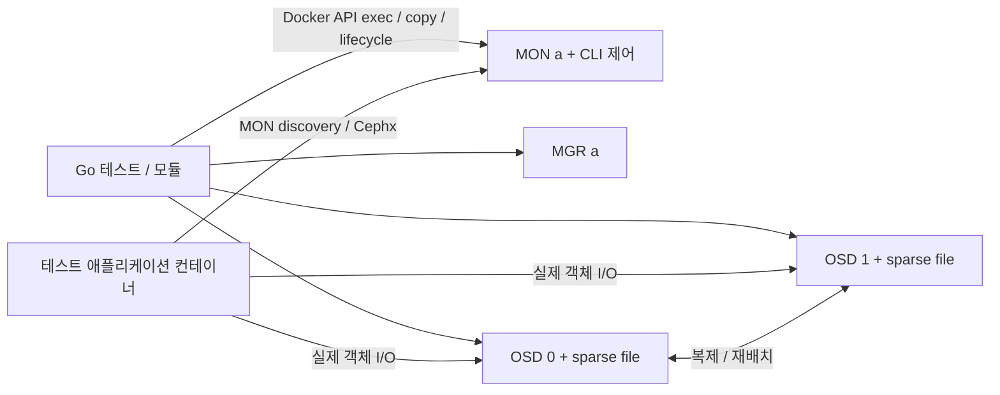

# 자료 조사와 가능성 판단

조사일: 2026-10-02. 목적은 Ceph 운영 환경 재현보다 Ceph와 통신하는 프로그램의 기능 및 토폴로지 변화 대응을 테스트하는 것입니다.

## 판단

컨테이너 내부의 공식 Ceph CLI와 파일 조회만으로 일회성 클러스터를 만들고 OSD를 추가·제거하는 방식은 실행 가능한 접근입니다. macOS ARM64의 Docker Desktop에서 실제 데몬, 인증, 객체 I/O, 재배치까지 확인했습니다. Go 코드에 `go-ceph`를 넣을 이유는 현재 제어 범위에서 발견되지 않았습니다.

RADOS/RBD/CephFS 클라이언트는 같은 Docker 네트워크에서 실행하는 조건으로 판단했습니다. macOS 호스트에서 직접 Ceph wire protocol을 사용하는 경우에는 별도 네트워크 설계가 필요합니다. MON 연결 후 클라이언트가 OSD에 직접 연결하는 구조이므로 단일 MON 포트 프록시가 전체 연결을 해결하지 않습니다. RGW의 S3 HTTP endpoint는 publish한 포트로 호스트에서도 접근할 수 있습니다. [Ceph 네트워크 구성](https://docs.ceph.com/en/tentacle/rados/configuration/network-config-ref/), [RGW HTTP frontend](https://docs.ceph.com/en/tentacle/radosgw/frontends/).

## 기존 모듈과 구성 방법

| 방법 | 확인한 특성 | 이번 PoC 판단 |
| --- | --- | --- |
| 기존 Ceph Testcontainers 모듈 | 공식 catalog의 Ceph 항목은 Java community module이며 Ceph Demo 단일 컨테이너 기반 | Go에서 개별 OSD lifecycle을 제어하려는 범위를 직접 충족하지 않음 |
| cephadm | systemd, 컨테이너 런타임, 시간 동기화, LVM 등 호스트 관리 전제 | 작은 테스트 fixture의 초기 제어 방식으로는 의존성과 중첩 구성이 큼 |
| 공식 이미지의 데몬 직접 실행 | MON/MGR/OSD를 foreground로 실행하고 CLI로 상태 조회 및 OSD 등록 가능 | 채택 |
| BlueStore 개발용 파일 backing | Ceph 자체 개발 클러스터도 파일 기반 block/db/wal 설정을 사용 | 실제 디스크, loop 장치, privileged 없이 실행 가능성을 검증하는 데 적합 |

근거: [기존 Ceph 모듈](https://testcontainers.com/modules/ceph/), [cephadm 요구사항](https://docs.ceph.com/en/latest/cephadm/install/), [수동 배포](https://docs.ceph.com/en/quincy/install/manual-deployment/), [Ceph vstart.sh](https://github.com/ceph/ceph/blob/v19.2.3/src/vstart.sh), [BlueStore block 파일 옵션](https://github.com/ceph/ceph/blob/v19.2.3/src/common/options/global.yaml.in).

공식 [릴리스 목록](https://docs.ceph.com/en/latest/releases/)에서 현재 유지보수 버전인 Tentacle 20.2.4를 기본으로 선택했습니다. Quay manifest 조회로 linux/amd64와 linux/arm64 지원을 확인했으며 manifest digest를 고정했습니다. 첫 실험은 Squid 19.2.3에서 수행했고, 최종 기본값과 통합 테스트는 Tentacle 20.2.4로 전환했습니다.

## testcontainers-go 원칙 적용

[모듈 작성 가이드](https://golang.testcontainers.org/modules/)의 형태를 따릅니다.

- 공개 타입 이름은 `Container`, `testcontainers.Container`를 embed합니다.
- 진입점은 `Run(ctx, image, opts ...testcontainers.ContainerCustomizer)`입니다.
- 기본 옵션 뒤에 사용자 옵션을 적용하고 `testcontainers.Run`을 호출합니다.
- 클러스터 수/파일 크기 같은 request 외 상태는 자체 `Option`에서 처리합니다.
- 준비 상태는 CLI의 실제 성공, OSD up/in, MGR 활성화로 확인합니다.
- 오류와 함께 반환된 부분 생성 컨테이너도 cleanup할 수 있게 유지합니다.
- technology SDK는 생산 코드에 넣지 않고 문서, 예제, 테스트, CI를 제공합니다.

상위 `Container`는 MON 컨테이너를 embed하지만 `Terminate`를 override하여 전체 클러스터를 정리합니다. 호출자는 `testcontainers.CleanupContainer(t, cluster)`라는 기존 패턴을 사용할 수 있습니다.

## 구성과 제어 흐름

MON, MGR, OSD, 애플리케이션은 하나의 테스트 전용 bridge 네트워크에 연결합니다. 공식 이미지의 기본 entrypoint를 작은 부트스트랩 스크립트로 교체합니다. 데이터는 호스트 bind mount가 아닌 컨테이너 내부 경로에 둡니다.

MON 컨테이너를 유지되는 CLI 제어 지점으로 사용하므로 현재 범위에는 별도 control plane 전용 컨테이너가 필요하지 않았습니다. MON 여러 개의 장애/교체를 다룰 때에는 어느 MON이 중단되더라도 CLI 실행 지점을 유지하도록 별도 control 컨테이너를 분리할 가치가 있습니다. Docker lifecycle 자체는 계속 Go/testcontainers가 소유합니다.

OSD 추가는 `ceph-authtool`로 키 생성 → `ceph osd new` 등록 → keyring/config 복사 → BlueStore 파일 mkfs → OSD foreground 실행 → up/in 확인 순서입니다.

OSD 삭제는 CRUSH weight 0 → out → `safe-to-destroy` 성공 대기 → 컨테이너 stop → down 확인 → `ceph osd purge` → 컨테이너 제거입니다. 작은 클러스터의 `active+remapped` 문제를 피하도록 CRUSH reweight를 먼저 수행합니다. [OSD 추가·삭제 문서](https://docs.ceph.com/en/tentacle/rados/operations/add-or-rm-osds/), [safe-to-destroy CLI 의미](https://docs.ceph.com/en/quincy/man/8/ceph/).

## 이 방식으로 검증할 수 있는 것

CLI/JSON 관리 동작, 인증, 풀과 객체 기능, 실제 Ceph 프로토콜을 사용하는 클라이언트, OSD 수 변경과 데이터 재배치, OSD 정지/재시작에 대한 애플리케이션 반응을 테스트하는 기반이 됩니다. 이번 PoC에서 실제로 실행한 내용은 [POC.md](POC.md)를 기준으로 구분합니다.

파일 기반 BlueStore와 OSD failure domain, 적은 복제 수는 작은 fixture를 위한 설정입니다. 디스크 장애, 실제 호스트 failure domain, LVM, cephadm orchestration, 운영 성능/내구성은 이 구성의 검증 범위가 아닙니다.

RGW/S3는 일반 HTTP endpoint와 호스트 Go 클라이언트, RBD는 컨테이너 CLI, CephFS는 MDS와 컨테이너 내부 libcephfs 클라이언트로 확장했습니다. 각각 실제 저장 데이터와 OSD 토폴로지 변경을 검증하는 과정과 한계는 [SERVICES_POC.md](SERVICES_POC.md)를 기준으로 구분합니다. 소비 애플리케이션이 사용하는 SDK나 wire protocol 구현을 이 fixture에 연결하는 것이 다음 단계입니다. MON quorum 테스트는 독립된 후속 PoC가 필요합니다.

## 이미지 경량화

2026-10-02 당시에는 공식 이미지에서 필요한 RPM과 설치된 의존성만 복사해 scratch 이미지에 배치하는 경량화 PoC를 수행했습니다. 원본 Ceph 바이너리·glibc·Python ABI와 OSD plugin, Python binding, MGR core module을 보존하여 실제 Go fixture와 호환성을 확인했습니다. 이 설명은 당시 실험의 기록이며 이전 경량화 도구와 분석 문서는 현재 유지되는 인터페이스가 아닙니다.

당시 package/file inventory에서 RGW 제외는 RBD/CephFS용 payload 약 97 MB, RGW용 이미지의 MDS 제외는 약 6.5 MB로 관측했습니다. 미사용 RGW 도구와 denc plugin 약 112 MB는 추가 제거 후보였으며 제거 후 호환성을 입증하지 않았습니다. 이 값은 당시 이미지와 파일 크기의 관측이고 현재 output image 크기·다운로드 용량·runtime 메모리를 보장하지 않습니다.

현재 [이미지 프로젝트](../../ceph-testcontainers-images/README.md)는 [고정 요구사항](../../ceph-testcontainers-images/docs/IMAGE_REQUIREMENTS.md)을 정의하고, 주어진 로컬 이미지를 독립 Python checker의 quick/full 단계로 확인합니다. 경량 대안은 [공식 역할 추출](../../ceph-testcontainers-images/docs/ROLE_IMAGES.md)의 `control`·`osd`·`rgw`·`mds`·`all` 또는 배포판 패키지 기반 이미지입니다. Dashboard·운영 도구·개발 헤더는 요구하지 않지만 RBD/CephFS mirror 데몬은 control 요구사항에 포함합니다. 이미지에는 cluster setup을 넣지 않고 이 Go 모듈이 configuration·keyring·bootstrap·entrypoint를 런타임에 제공합니다. Custom 패키지나 native patch 이미지는 소유자가 제작합니다. 이미지 checker의 full 시나리오는 별도 Docker CLI 검증이므로 이 저장소의 named Go 테스트 결과와 구분합니다.
